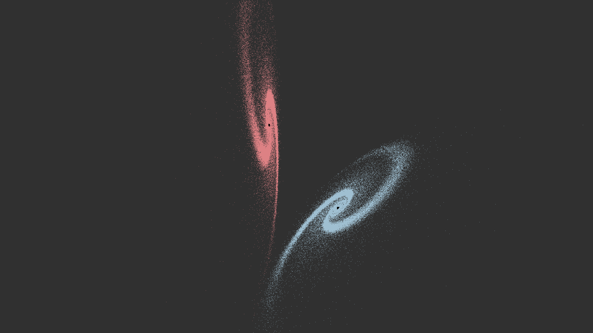
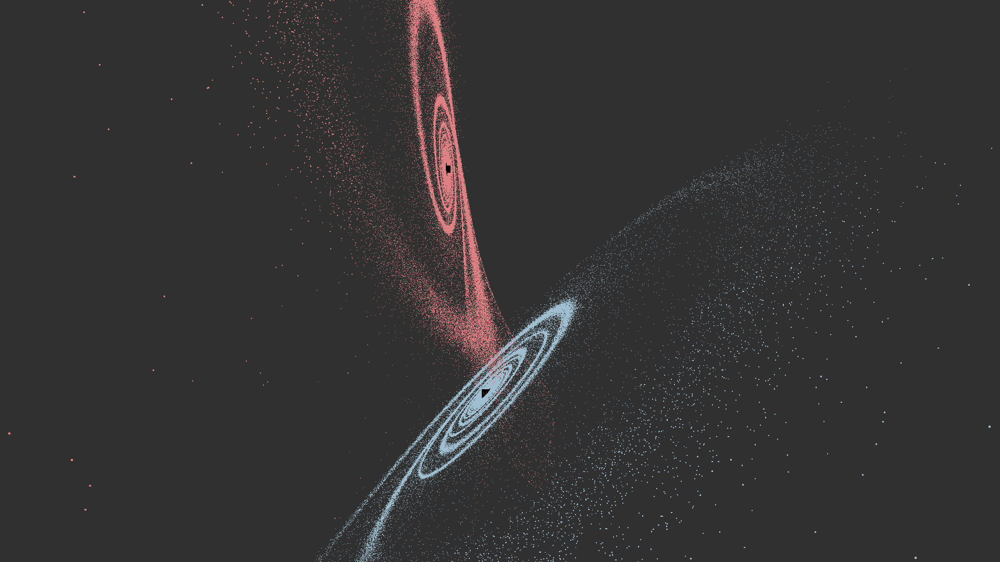
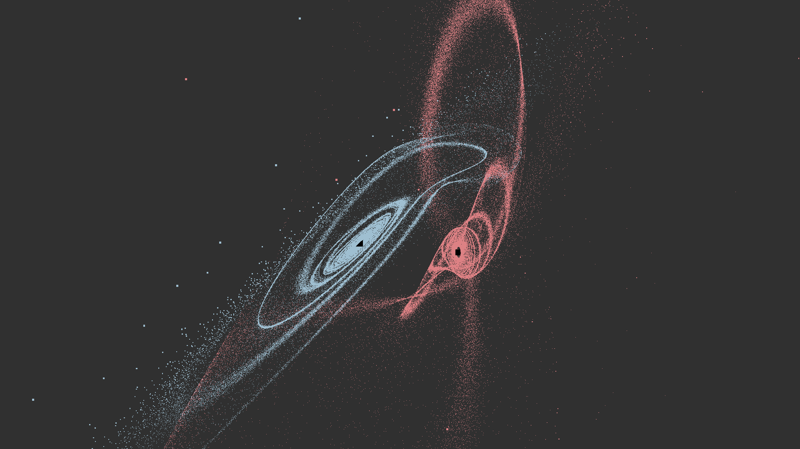
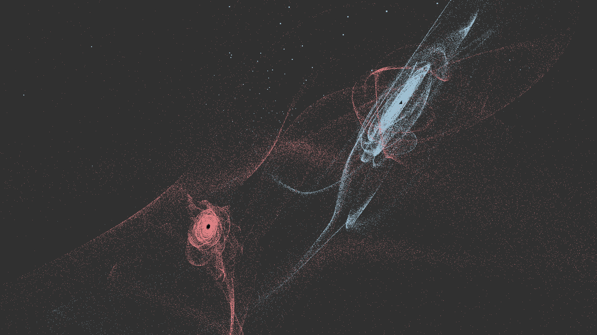
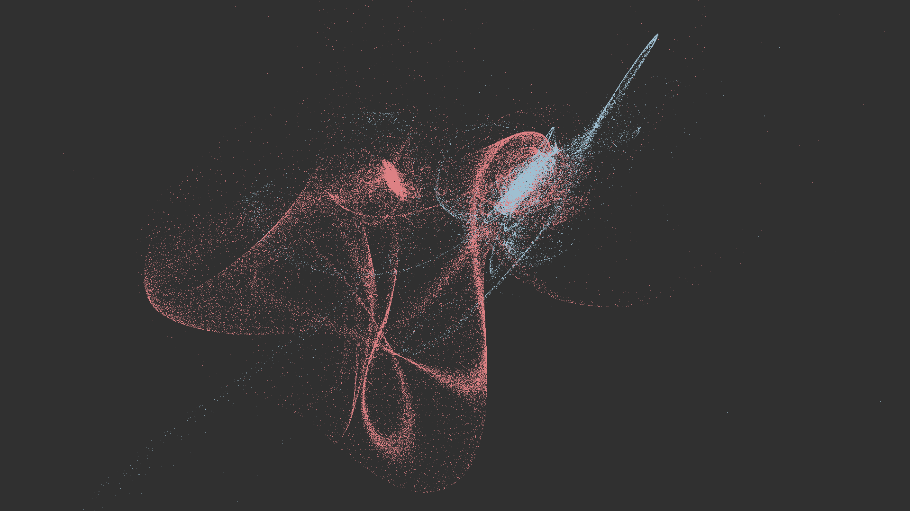
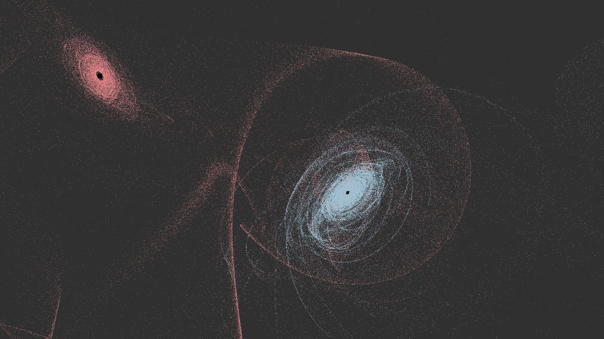
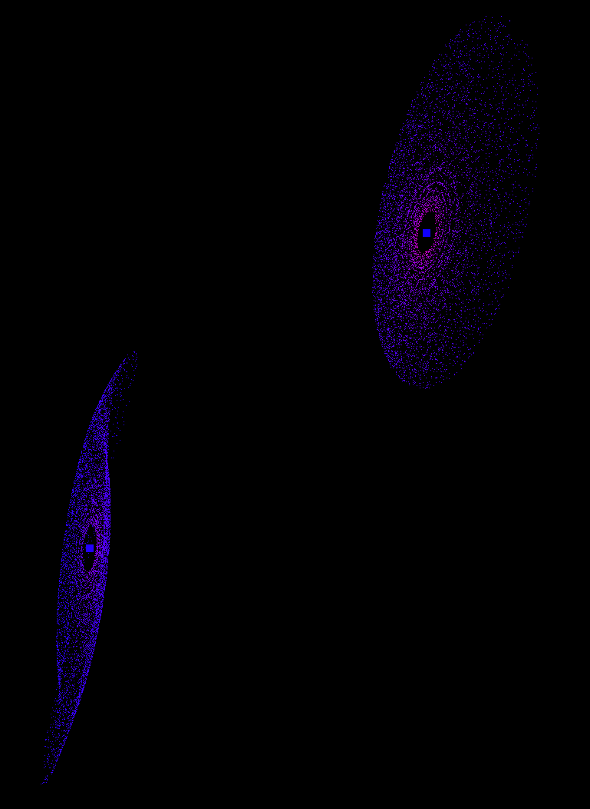
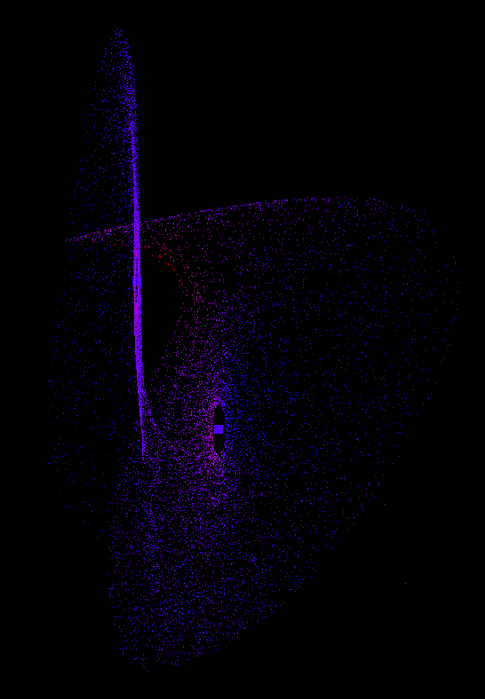

N-Body-Simulation
=================

Features:
- 3D
- Realtime
- GPU Acceleration using wgpu
- Save configurations in external files (see examples/)

Controls:
- Move: WASD, Shift, Space, Move mouse
- Change movement speed: Scroll wheel
- Change simulation speed: 0-6 number keys
- Print fps to console: F

## Usage

### From binary

Download the latest executable from [the GitHub release page](https://github.com/timokoesters/nbodysim/releases).
You can either start the binary on its own or give it the path to a configuration as an argument like this:
```bash
$ ./nbodysim examples/two-galaxies.ron
```
You can see example configurations [here](https://github.com/timokoesters/nbodysim/tree/master/examples).

### From source
First, make sure you have rust installed. You can find installation instructions [here](https://www.rust-lang.org/tools/install).
```bash
# Clone the repo
$ git clone https://github.com/timokoesters/nbodysim.git
$ cd nbodysim

# Compile
$ cargo build --release

# Run default config
$ cargo run --release

# Run custom config
$ cargo run --release -- examples/two-galaxies.ron
```











